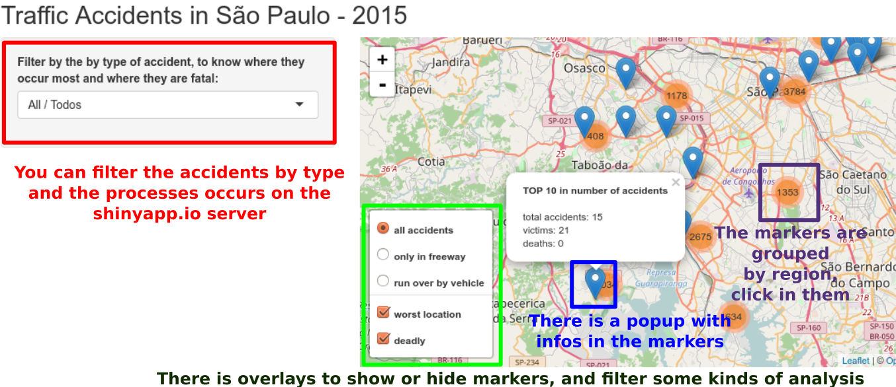
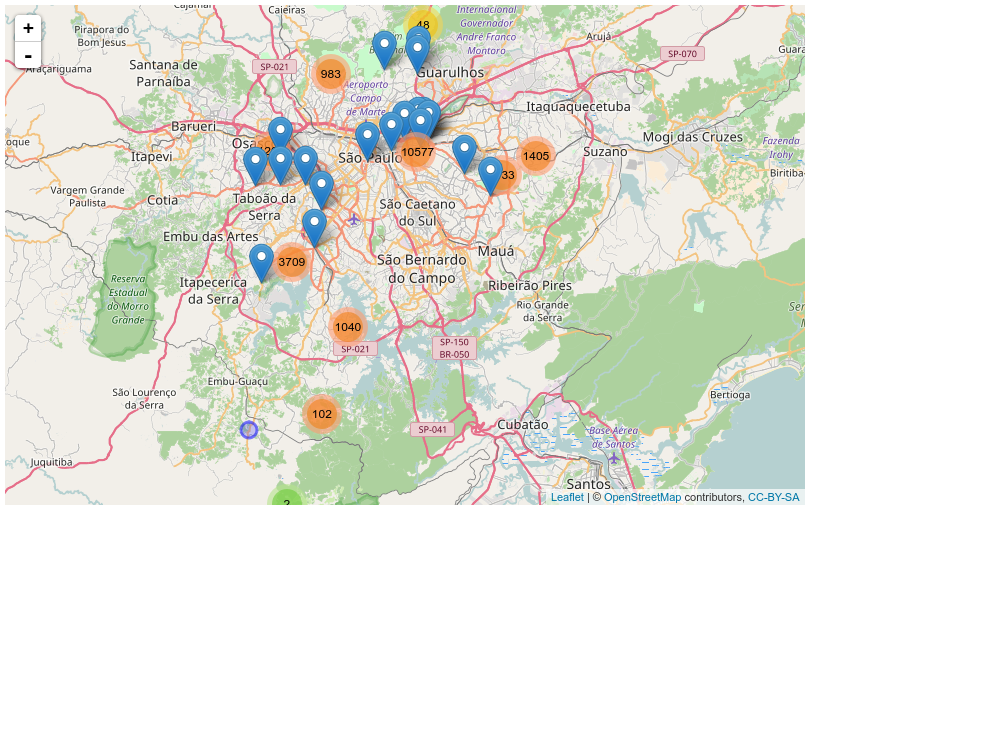
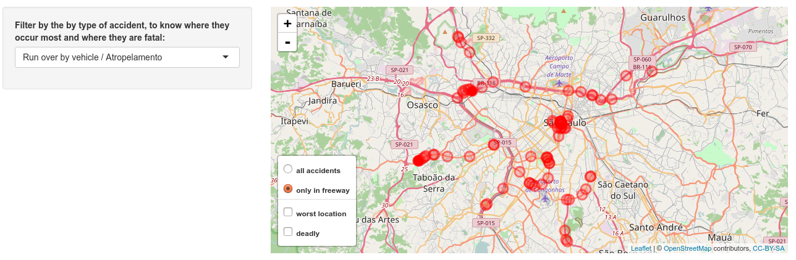
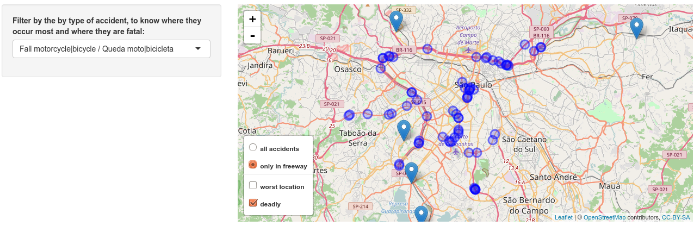

Traffic Accidents In São Paulo - 2015
========================================================
author: Wagner Pinheiro
date: February, 2017
autosize: true

The Shiny App Demo


The App
========================================================

Interactive map of traffic accidents in the metropolitan region of São Paulo, clustered by region and type, during the year 2015.

See the hosted app on [Shinyapp.io](https://wagnerpinheiro.shinyapps.io/traffic_accidents_in_so_paulo_-_2015/)

The source code is on [Github](https://github.com/wagnerpinheiro/traffic-accidents-pmsp)


App Screenshot
========================================================



Making the figures
========================================================
Source code to generate all figures used in this presentation


```r
source("main.R")
suppressPackageStartupMessages(library(mapview))
dataset <- TrafficAccidents.loadDataset()
m <- TrafficAccidents.plotTrafficAccidents(dataset)
mapshot(m, file = paste0(getwd(),"/presentation_app-figure/map_all_accidents.png"))
m <- TrafficAccidents.plotTrafficAccidents(dataset, "QM")
mapshot(m, file = paste0(getwd(),"/presentation_app-figure/map_motorcyclists.png"))
```

Example 1: Browser for all accidents
========================================================

This image was generated in the previous slide using the lib:




Example 2: Get only the run-overs in freeway
========================================================

First filter by "run over by vehicle", and mark "only in the freeway"



Example 3: Deadly places for Motorcyclists
========================================================

First filter by "fall motorcycle", and mark "only in the freeway" and "deadly"



Background News
========================================================

In the last 2 years, São Paulo has been going through several discussions about the reduction of accidents involving the reduction of speeds on the freeways. To know more:

- [Reducing Speeds in Sao Paulo, Brazil Leads to Record Low Traffic Fatalities](http://www.wrirosscities.org/news/reducing-speeds-sao-paulo-brazil-leads-record-low-traffic-fatalities) - July, 2016
- [Reduced Speed on Margins reduces accidents and slowness](https://translate.google.com/translate?sl=pt&tl=en&js=y&prev=_t&hl=en&ie=UTF-8&u=http%3A%2F%2Fultimosegundo.ig.com.br%2Figvigilante%2Ftransito%2F2016-07-20%2Freducao-da-velocidade-nas-marginais.html&edit-text=) - July, 2016
- [Mayor Doria against the world, increases speed in the Marginais (freeways)](https://translate.google.com/translate?sl=pt&tl=en&js=y&prev=_t&hl=en&ie=UTF-8&u=http%3A%2F%2Fwww.revistaforum.com.br%2F2016%2F12%2F20%2Fdoria-na-contramao-do-mundo-aumenta-velocidade-nas-marginais%2F&edit-text=) - December, 2016

In portuguese:

- [Redução da velocidade nas Marginais diminui acidentes e lentidão](http://ultimosegundo.ig.com.br/igvigilante/transito/2016-07-20/reducao-da-velocidade-nas-marginais.html) - July, 2016
- [Dória, na contramão do mundo, aumenta velocidade nas Marginais](http://www.revistaforum.com.br/2016/12/20/doria-na-contramao-do-mundo-aumenta-velocidade-nas-marginais) - December, 2016
